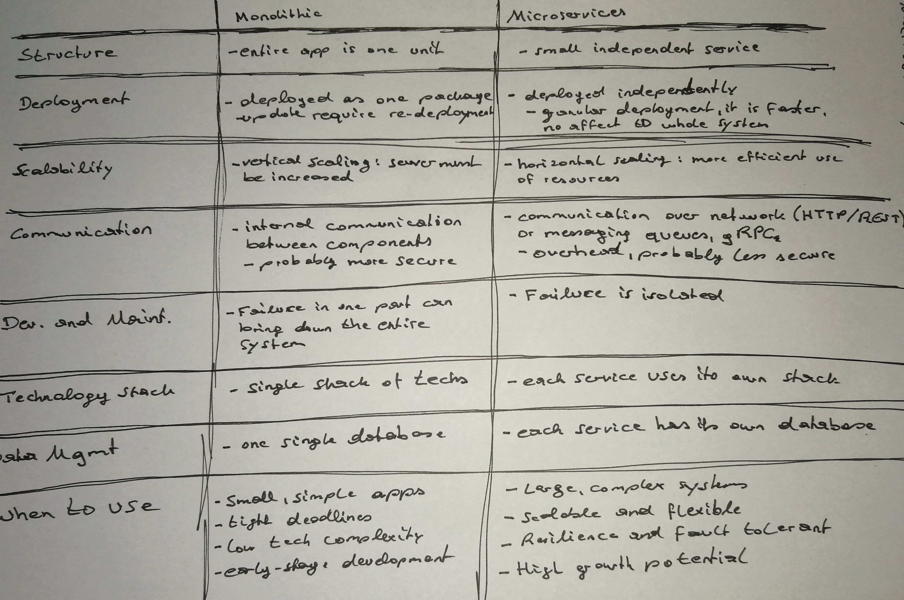
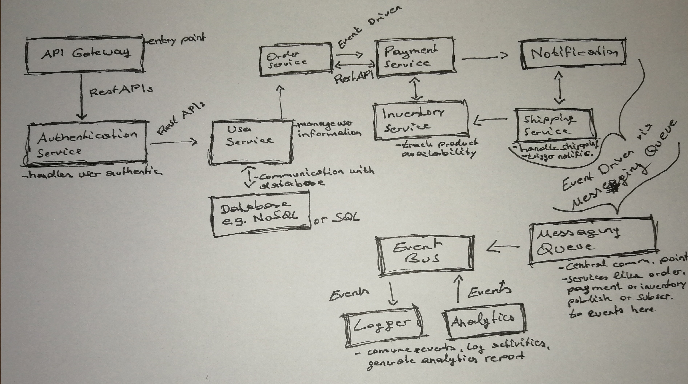
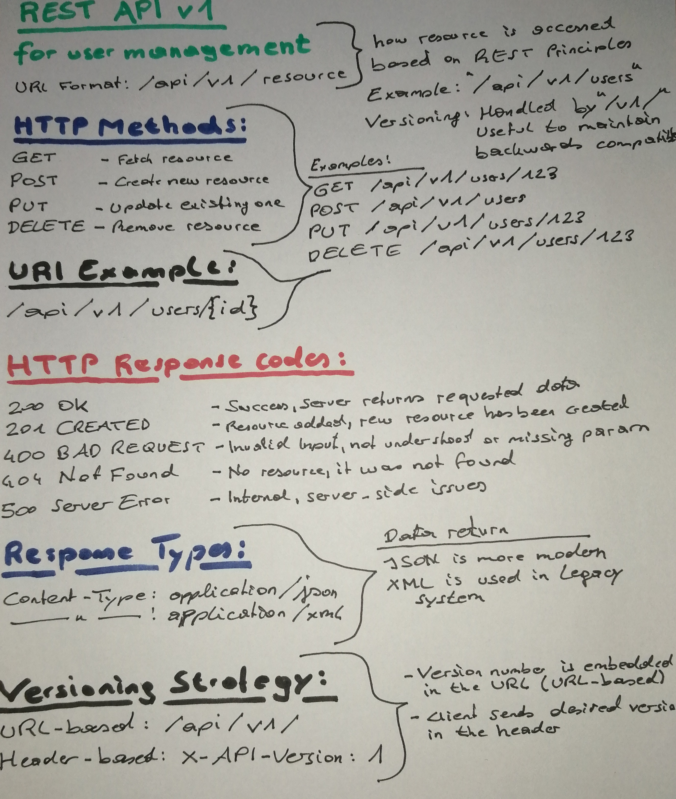
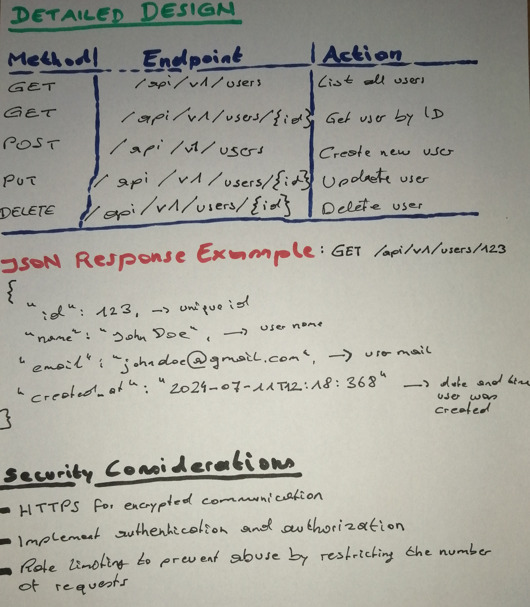

# Software Architecture and Design Patterns Exercises

### Understand Architectural Styles

- Describe the key differences between monolithic and microservices architectures. In what scenarios would you choose one over the other?

----

- Design a simple application using layered architecture. Define the responsibilities of each layer and how they interact.

----

- Create a diagram that illustrates the relationships between services in a microservices architecture. Include details on how they communicate (e.g., REST, messaging queues, or event-driven communication).

----

- Compare event-driven architecture with request-response architecture. Discuss when to use each approach in distributed systems.
- Evaluate the pros and cons of adopting serverless architecture for an e-commerce application. What design considerations should you keep in mind?
- Propose an architecture for a real-time collaborative document editing platform. How would you manage synchronization and concurrency between clients?
- Analyze a given architecture and suggest how to apply the CQRS (Command Query Responsibility Segregation) pattern. Discuss its potential benefits and drawbacks.
- Design a highly scalable architecture for a streaming service (e.g., Netflix). Discuss how to handle high availability, fault tolerance, and load balancing.

### SOLID Principles

- Rewrite a given class to adhere to the Single Responsibility Principle (SRP) by splitting it into multiple classes. Justify your design choices.
- Analyze an existing codebase and identify violations of the Open/Closed Principle (OCP). Propose modifications to make the code compliant with OCP.
- Implement a subclass that violates the Liskov Substitution Principle (LSP). Discuss how the violation could impact the system and propose a refactor.
- Refactor an interface that violates the Interface Segregation Principle (ISP) into smaller, more specific interfaces. Explain the benefits of this approach in terms of flexibility and maintainability.
- Design a simple application that follows the Dependency Inversion Principle (DIP). Illustrate how high-level modules depend on abstractions instead of concrete implementations.
- Review a given software design and discuss how adhering to SOLID principles could improve its scalability and testability.
- Apply the SOLID principles to an existing legacy system and document how each principle was applied to improve code maintainability.
- Discuss how violating multiple SOLID principles in a system can lead to code rigidity, fragility, and immobility.

### Creational Patterns

- Implement a Singleton class in a multi-threaded environment. Discuss potential issues such as thread safety and how to resolve them using double-checked locking or other techniques.
- Create a factory method for a product line that includes at least three different product types. Provide a demonstration of the factory in action, showing how it can be easily extended.
- Design a builder for constructing a complex object (e.g., a vehicle with multiple attributes). Demonstrate the builder pattern with an example, highlighting the benefits of immutability.
- Implement a prototype pattern that enables cloning of an object with mutable state. Discuss challenges you might face with deep vs. shallow copying, and how you'd handle circular references.
- Compare and contrast the abstract factory pattern with the factory method pattern. Implement a small project where both are used, and discuss when one is preferable over the other.
- Design an object pool pattern for managing reusable database connections. Implement the pattern and simulate a real-world use case.
- Develop a lazy initialization pattern for an application that loads large configuration files. Explain the trade-offs between memory usage and performance.
- Implement a dependency injection pattern to manage object creation and wiring in a complex application. Demonstrate how this reduces coupling and increases testability.

### Structural Patterns

- Create an adapter that allows a new payment method to integrate into an existing e-commerce application. Provide a sample usage and discuss how the adapter pattern increases flexibility.
- Develop a composite pattern to represent a file system structure, including files and directories. Demonstrate operations like adding, removing, and searching within this structure.
- Design a coffee shop application that uses the decorator pattern to add different features (e.g., milk, sugar) to a coffee order. Provide examples of multiple layers of decorators applied in sequence.
- Implement a façade pattern to simplify interactions with a complex third-party library in a project. Show how the façade can hide complexity and make the library easier to use.
- Create a proxy pattern for a remote service that handles caching and lazy loading of data. Demonstrate how the proxy improves performance by avoiding unnecessary calls to the remote service.
- Use the bridge pattern to separate an abstraction (e.g., device control interface) from its implementation (e.g., different device types). Provide examples showing how the two can vary independently.
- Design a flyweight pattern for managing a large number of similar objects (e.g., characters in a word processor). Demonstrate how memory usage can be reduced by sharing intrinsic state.
- Implement the composite pattern to build a complex user interface where UI components (buttons, panels, etc.) are nested. Show how to handle rendering and user interactions.

### Behavioral Patterns

- Implement a strategy pattern that allows users to choose different sorting algorithms. Compare the performance of different strategies with varying data sets.
- Create a simple observer pattern implementation where a news agency notifies subscribers of news updates. Provide an example of multiple subscriber behaviors (e.g., push notifications, emails).
- Design a command pattern for a remote control application. Implement commands to turn on and off various devices. Show how to queue commands for execution and undo previous commands.
- Develop a mediator pattern to manage complex interactions between UI components in a form (e.g., enabling/disabling fields based on user input). Explain how the mediator simplifies communication between components.
- Implement a chain of responsibility pattern for a customer support system that handles requests at different levels (e.g., support agents, managers). Demonstrate how requests can be passed along the chain.
- Design a state pattern for a vending machine that transitions between different states (e.g., selecting an item, waiting for payment, dispensing). Show how state transitions are handled.
- Create a template method pattern for generating reports in different formats (e.g., PDF, HTML). Demonstrate how the template method defines the report structure while allowing customization of specific parts.
- Implement the interpreter pattern to build a simple language interpreter (e.g., for arithmetic expressions). Demonstrate how to parse and evaluate expressions using the pattern.

### General Software Design

- Analyze a real-world application (e.g., a mobile app) and describe its architectural style. What are the strengths and weaknesses of this architecture?
- Write a report on the importance of design patterns in software development. Include examples from various projects you've encountered, detailing how they improved code quality.
- Propose an architecture for a new social media platform. Outline the key components (e.g., user management, content delivery, notifications), their responsibilities, and how they interact.
- Investigate how microservices, event-driven architectures, and reactive programming can be combined to create scalable systems. Provide an example architecture that uses these techniques.
- Design a multi-tenant SaaS (Software as a Service) platform that supports data isolation and configuration per tenant. Discuss the challenges of scaling such a system.
- Evaluate a legacy monolithic application and propose a strategy for gradually migrating it to a microservices-based architecture. Discuss how to manage dependencies and data consistency during the migration.
- Create a high-level architecture for a ride-hailing app (e.g., Uber). Identify the main services and communication patterns (e.g., location tracking, ride matching, payment processing).
- Discuss the role of Domain-Driven Design (DDD) in modern software architecture. Propose a design for a specific domain (e.g., e-commerce) using DDD principles.

### Advanced Topics

- Discuss how you would integrate a caching mechanism into a microservices architecture to improve performance. What challenges might you face with cache invalidation and data consistency?

*How to implement?*
*- Data caching directly on the browser*
*- Implement the caching mechanism at API Gateway Level*
*- Each Microservice cna implemtn its own caching mechanism as well*

*What can be cached? Database query results, API Responses, Session data, static content*

*Challanges*
*- Removing or updating cached data when underlying data source changes. Cached data can become outdated, updating wrong data may result in race conditons, data updating over different services can become complex. Solution: Event-based invalidation via message brokers, set expiration times*
*- Esuring consistency between the cache and the underlying data. The Synchronization is hard, because the data update may not be reflected by the cache immediately, for some usecases strogn consistency is required which is harder to maintain, user interactions can cause conflicts: A user might read stale data from the cache right after another user has written new data to the database but before the cache has been invalidated. Solutions: Implement read-through or write-through caching, use acombination of short TTLs, event-driven cache invalidation and string database transactions*

----

- Design an API for a web service using REST principles. Consider how to handle different HTTP methods, response types, and versioning of the API.

----

- Evaluate the trade-offs between synchronous and asynchronous communication in microservices. Provide examples of when to use each and how to handle error scenarios.

*Synchronous Communication*
*- Pros: Client gets immediate response, easier to implement, sincecaller waits for a response, easier to validate if the operation was completed*
*- Cons: Services become ithtly coupled, calling service waits for response which can lead to increased latency, if one service goes down, it can cascade failures*
*When to use: When app needs immediate feedback: Fetching user feedback, if the interaction is a simple request-response and latency isn't a major concern*

*Asynchronous Communication*
*- Pros: Services are decoupled, better ahdling high loads because msgs are processed in the background*
*- Cons: Managing distributed queues adds complexity, data consistency can be more challenging because operations complete at different time, troublseshooting asynchronous workflows can be difficult*
*When to use: When no immediate response is needed, when handling high-throughput tasks, when events trigger downstreams action sthat don't need to be performed immediately*

----

- Propose a strategy for implementing service discovery in a microservices architecture. Compare different approaches (e.g., client-side discovery, server-side discovery) and their trade-offs.

----

- Design an event-driven architecture for a real-time analytics platform. Discuss how to handle large-scale data ingestion, processing, and visualization.
- Discuss the benefits and challenges of using the event sourcing pattern in an application that requires a detailed audit log of all actions.
- Create a system architecture that leverages both horizontal and vertical scaling techniques. Identify key bottlenecks and how to scale specific components.
- Analyze how the CAP theorem applies to a distributed database system. Propose strategies for achieving high availability and partition tolerance while minimizing trade-offs.

### Real-World Application

- Pick a design pattern and identify a real-world application that uses it. Describe how the pattern is implemented and its benefits.
- Create a small project where you implement several design patterns. Document the patterns used and the rationale for choosing each.
- Investigate a legacy system and propose a refactor using modern architectural principles. Discuss potential challenges in implementation.
- Design a large-scale e-commerce platform. Include considerations for scalability, reliability, and fault tolerance. Explain which design patterns and architectural styles you would use.
- Study a popular open-source project and analyze its architectural style. Identify areas where design patterns are applied and suggest improvements if necessary.
- Create a microservices-based online learning platform that supports video streaming, course management, and student analytics. Discuss the use of APIs, authentication, and scalability.
- Implement a blockchain-based voting system. Discuss how the architecture ensures security, transparency, and resilience.
- Analyze the architecture of a real-time multiplayer game. Discuss how the system handles synchronization, latency, and fault tolerance.

### Reflection and Discussion
- Reflect on a software project you worked on. Identify any design patterns you used and discuss their impact on the project's success.
- Engage with peers in a discussion about the challenges of applying design patterns in real-world projects. Share experiences, challenges, and solutions.
- Consider the impact of software architecture on

 team collaboration. Discuss how architectural decisions can influence team dynamics, communication, and productivity.
- Debate the trade-offs of using microservices vs. a monolithic architecture in a rapidly growing startup. How do these architectural choices affect team velocity and technical debt?
- Reflect on a time when applying a design pattern led to unintended consequences in a project. What would you do differently next time?
- Explore how the shift to cloud-native architectures impacts the application of traditional design patterns. Discuss the challenges of adapting patterns to cloud environments.
- Investigate the role of technical debt in software design and architecture. How do design patterns help manage or contribute to technical debt?
- Share insights on how agile practices and continuous integration influence software architecture decisions, particularly in large, distributed teams.

### Code Review and Improvement

- Review a codebase and identify areas where design patterns could be applied to improve maintainability. Propose specific patterns and modifications.
- Create a checklist of best practices for applying SOLID principles in software design. Use this checklist to review your own work or that of a colleague.
- Pair program with a colleague to refactor a piece of legacy code. Apply design patterns as necessary, and discuss the changes made and their impact.
- Conduct a code review focusing on adherence to design patterns. Provide feedback on how well the code applies patterns and where improvements could be made.
- Perform a design review of an API or service. Suggest improvements to the architecture or design patterns used to enhance scalability or reliability.
- Refactor a highly coupled codebase by introducing dependency injection. Measure the improvement in testability and maintainability post-refactor.
- Analyze the scalability of a given codebase. Identify bottlenecks and propose design patterns to alleviate them (e.g., using the circuit breaker pattern to handle failures).
- Conduct a performance review of a system architecture. Recommend design patterns that could improve performance, such as caching, lazy loading, or asynchronous processing.

### Continuous Learning

- Research a design pattern not covered in this document. Present your findings to the team, including its use cases, implementation examples, and potential drawbacks.
- Follow an online course on software architecture or design patterns. Document key learnings and how you plan to apply them in future projects.
- Join a community of software developers focused on architecture and design patterns. Participate in discussions and share insights from your projects.
- Identify a trend in modern software architecture (e.g., microservices, event-driven architecture, serverless computing). Research its impact on traditional design patterns.
- Attend a software architecture or design pattern conference or meetup. Share insights gained and how they can be applied to your current projects.
- Start a book club within your team focused on software design and architecture. Choose a book on patterns or principles and discuss its application to real-world projects.
- Review case studies of large-scale software projects (e.g., Netflix, Airbnb). Identify how design patterns were used and discuss the challenges they faced during scaling.
- Investigate emerging trends such as AI/ML in software architecture. Discuss how these technologies might influence the application of traditional design patterns.